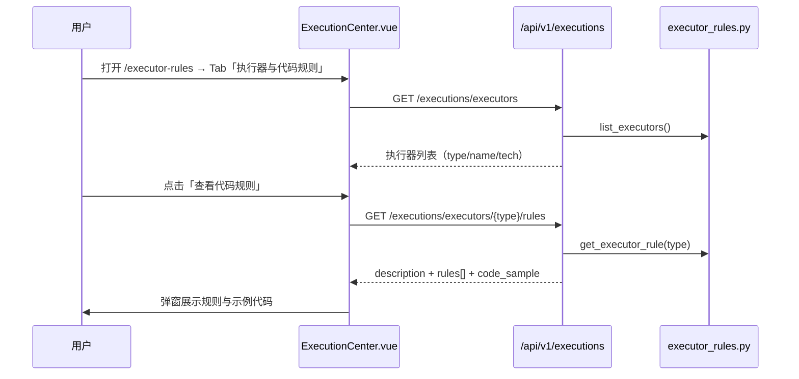
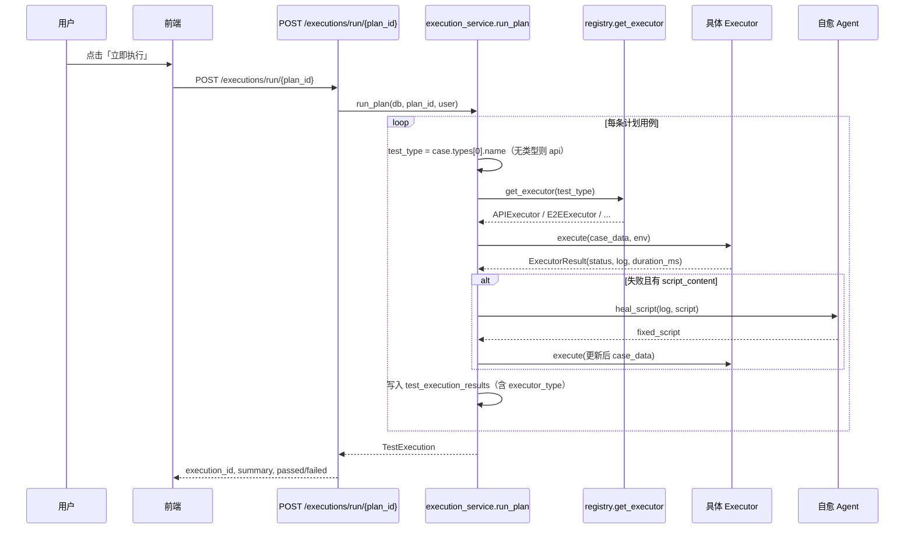

# 执行器与代码规则说明

本文档说明本平台中**执行器（Executor）**与**代码规则（Executor Rules）**的定义位置、调用链路、使用规则及扩展方式。

---

## 1. 概念区分

| 概念 | 含义 | 主要用途 |
|------|------|----------|
| **执行器** | 实际运行测试用例的插件类 | 计划执行时按用例类型自动选择并调用 |
| **代码规则** | 执行器的说明文档 + 代码示例 | 供前端「执行器与代码规则」页面展示，指导用例编写 |
| **执行人（executor_name）** | 触发计划的用户名 | 记录在 `test_executions` 表，与执行器插件无关 |

> 注意：界面上的「执行人」指**谁点了执行**；结果表中的「执行器（executor_type）」指**哪类插件跑了这条用例**。

---

## 2. 在系统中的位置

### 2.1 后端目录

```
backend/app/executors/
├── base.py                 # 执行器基类与 ExecutorResult
├── registry.py             # 类型 → 执行器类 注册表
├── executor_rules.py       # 代码规则与示例（只读文档）
├── api_executor.py         # 接口测试
├── unit_executor.py        # 单元测试
├── e2e_executor.py         # E2E / UI 测试
├── performance_executor.py   # 性能测试
└── agent_test_executor.py    # Agent 测试
```

### 2.2 调用入口

| 层级 | 文件 | 职责 |
|------|------|------|
| API | `backend/app/api/executions.py` | 暴露执行器列表、规则查询、计划执行接口 |
| 服务 | `backend/app/services/execution_service.py` | `run_plan()` 遍历用例并调度执行器 |
| 注册 | `backend/app/executors/registry.py` | `get_executor(test_type)` 按类型实例化插件 |

### 2.3 前端页面

| 路由 | 组件 | 功能 |
|------|------|------|
| `/executor-rules` | `frontend/src/views/executions/ExecutionCenter.vue` | **执行器与代码规则** Tab + 计划执行 + 执行历史 |
| `/executions` | `frontend/src/views/standalone/TestExecutionsPage.vue` | 按项目筛选执行计划/记录，可跳转规则页 |
| `/executions/:id/results` | `ExecutionResults.vue` | 单条执行结果，含 `executor_type` 列 |
| `/executions/:id/logs` | `ExecutionLogs.vue` | 执行过程日志 |
| `/reports` | `ReportsPage.vue` | 报告汇总，展示执行器类型 |

侧边栏菜单项：**执行器规则** → `/executor-rules`（`MainLayout.vue`）。

---

## 3. 调用链路

### 3.1 查看代码规则（只读）



### 3.2 创建计划时绑定执行类型

创建/编辑测试计划时必须选择 `executor_type`（api / unit / e2e / performance / agent）。  
执行时**以计划上的类型为准**调用 `get_executor(plan.executor_type)`，并将对应 `executor_rules` 写入执行环境 `environment.executor_rule`。

| 计划执行类型 | 绑定执行器 | Chrome 目录 |
|-------------|-----------|-------------|
| api | APIExecutor | — |
| unit | UnitExecutor | — |
| e2e | E2EExecutor + Google Chrome | `PLAYWRIGHT_BROWSERS_PATH`（默认 `/app/data/browsers`） |
| performance | PerformanceExecutor | — |
| agent | AgentTestExecutor | — |

### 3.3 执行测试计划（真正调用执行器）



### 3.3 CI Webhook 触发

```
POST /api/v1/executions/webhook/ci
Header: X-Webhook-Secret（与 .env 中 WEBHOOK_SECRET 一致）
Body: { "plan_id": "<uuid>" }
→ 同样调用 run_plan(..., trigger_type="ci")
```

---

## 4. API 接口一览

| 方法 | 路径 | 说明 |
|------|------|------|
| `GET` | `/executions/executors` | 执行器列表（前端表格数据源） |
| `GET` | `/executions/executors/rules/all` | 全部规则摘要 |
| `GET` | `/executions/executors/{type}/rules` | 单个执行器的完整规则与代码示例 |
| `POST` | `/executions/run/{plan_id}` | 执行计划（**此处调用执行器**） |
| `GET` | `/executions/plans` | 可执行计划列表 |
| `GET` | `/executions/history` | 执行历史 |
| `GET` | `/executions/detail/{execution_id}` | 执行详情 |
| `GET` | `/executions/{execution_id}/results` | 用例级结果（含 `executor_type`） |
| `GET` | `/executions/{execution_id}/logs` | 执行日志 |
| `POST` | `/executions/webhook/ci` | CI 触发执行 |

所有接口前缀为 `/api/v1`（由前端 `http.ts` 的 `baseURL` 决定）。

---

## 5. 执行器类型映射规则

`registry.get_executor(test_type)` 根据**用例的第一个测试类型名称**选择执行器：

| 用例类型名（test_case_types.name） | 映射执行器 | 实现类 |
|-----------------------------------|------------|--------|
| `功能` | api | `APIExecutor` |
| `接口` | api | `APIExecutor` |
| `api` / `integration` | api | `APIExecutor` |
| `unit` | unit | `UnitExecutor` |
| `e2e` / `uat` / `ui` | e2e | `E2EExecutor` |
| `性能` / `performance` | performance | `PerformanceExecutor` |
| `agent` / `Agent测试` | agent | `AgentTestExecutor` |
| **未匹配** | api（默认） | `APIExecutor` |

类型解析代码（`execution_service.py`）：

```python
test_type = case.types[0].name if case.types else "api"
executor = get_executor(test_type)
```

**使用建议**：创建用例时务必设置正确的「测试类型」，否则将走默认 `APIExecutor`。

---

## 6. 各执行器使用规则

### 6.1 接口测试（APIExecutor）

- **技术底座**：Requests（httpx）+ 步骤驱动
- **用例字段**：
  - `steps`：JSON 数组，每项建议包含：
    - `url`：请求地址（可相对路径，会拼 `base_url`）
    - `method`：GET / POST / PUT / DELETE 等
    - `body`：请求体（可选）
    - `expected_status`：期望 HTTP 状态码，默认 `200`
  - `script_content`：可选；失败时可触发自愈 Agent 重写脚本
- **环境变量**（执行时 `environment` 参数）：
  - `base_url`：默认 `http://localhost:8000`

示例 `steps`：

```json
[
  {
    "url": "/api/v1/health",
    "method": "GET",
    "expected_status": 200
  },
  {
    "url": "/api/v1/auth/login",
    "method": "POST",
    "body": { "username": "admin", "password": "admin123" },
    "expected_status": 200
  }
]
```

### 6.2 单元测试（UnitExecutor）

- **技术底座**：Pytest（当前为演示占位）
- **用例字段**：
  - `script_content`：**必填**，存放可执行 Python / Pytest 脚本
- **行为**：
  - 无 `script_content` → 状态 `skipped`
  - 有脚本 → 当前演示模式直接返回 `passed`（生产应接入沙箱）

### 6.3 E2E / UI 测试（E2EExecutor）

- **技术底座**：Playwright（框架占位）
- **用例字段**：`name`、`steps`（可扩展为页面操作描述）
- **环境变量**：
  - `target_url`：被测页面地址，默认 `about:blank`
- **说明**：当前为演示实现，日志返回 `E2E 演示执行完成`；接入真实 Playwright 需在 Worker 镜像中安装浏览器。

### 6.4 性能测试（PerformanceExecutor）

- **技术底座**：Locust（演示占位）
- **返回扩展**：`extra.tps`、`extra.avg_latency_ms`
- **说明**：当前固定返回演示指标；可对接 Locust 分布式 Worker。

### 6.5 Agent 测试（AgentTestExecutor）

- **技术底座**：`AIHub` 多 Agent 编排
- **用例字段**：
  - `query` 或 `name`：作为 Agent 输入
  - 完整 `case_data` 传入 `hub.orchestrate()`
- **判定**：返回含 `result` 则 `passed`，否则 `failed`

---

## 7. 代码规则模块（executor_rules.py）

`EXECUTOR_RULES` 字典为**静态文档**，与执行器实现解耦：

- 前端「查看代码规则」只读此数据
- `get_executor_rule(type)` 支持中文别名（如 `功能`→`api`）
- `list_all_rules()` 去重后返回摘要列表

修改规则展示内容：编辑 `backend/app/executors/executor_rules.py` 即可，**无需改数据库**。

修改真实执行逻辑：编辑对应的 `*_executor.py` 与 `registry.py` 映射。

---

## 8. 执行环境与配置

### 8.1 单次执行环境

手动执行计划时可传 body：

```json
{
  "environment": {
    "base_url": "http://localhost:8000",
    "target_url": "http://localhost:5173"
  }
}
```

未传时默认：`{"base_url": "http://localhost:8000"}`。

### 8.2 .env 预留项（尚未接入 run_plan）

| 变量 | 默认值 | 说明 |
|------|--------|------|
| `EXECUTOR_MAX_RETRY` | 3 | 失败重试次数（预留） |
| `EXECUTOR_TIMEOUT_SECONDS` | 300 | 单用例超时（预留） |
| `EXECUTOR_PARALLEL_WORKERS` | 4 | 并行 Worker 数（预留） |

当前 `run_plan` 为**同步串行**执行，上述配置已在 `config.py` 定义但尚未在执行循环中使用；后续可接 Celery（`CELERY_BROKER_URL`）做异步并行。

---

## 9. 执行结果落库

| 表 | 关键字段 | 说明 |
|----|----------|------|
| `test_executions` | `executor_name` | 执行人（用户名） |
| `test_executions` | `environment` | 本次环境 JSON |
| `test_execution_results` | `executor_type` | 本条用例使用的执行器类型名 |
| `test_execution_results` | `healed` | 是否经自愈 Agent 修复后重跑 |
| `test_execution_logs` | `message` | 逐步骤日志 |

---

## 10. 自愈（Healing）与执行器的关系

执行器失败**且**用例含 `script_content` 时：

1. 调用 **自愈 Agent**（`AgentType.HEALING`）
2. 若返回 `fixed_script`，更新用例脚本并重跑**同一执行器**
3. 结果标记 `healed=true`

接口类用例主要依赖 `steps` 结构，自愈主要针对带自动化脚本的用例。

---

## 11. 如何新增一种执行器

1. 在 `backend/app/executors/` 新建 `xxx_executor.py`，继承 `BaseExecutor`，实现 `async execute(case_data, env_config)`
2. 在 `registry.py` 的 `_REGISTRY` 注册类型键 → 类
3. 在 `executor_rules.py` 的 `EXECUTOR_RULES` 增加文档与 `code_sample`
4. 在 `init_db.py` 的 `PRESET_TYPES` 或管理界面增加对应测试类型名（可选）
5. 重新构建并部署后端

---

## 12. 推荐使用流程

1. **了解规则**：菜单 → 执行器规则 → 查看对应类型的代码规则与示例
2. **编写用例**：在用例管理中设置正确的「测试类型」，并按规则填写 `steps` 或 `script_content`
3. **关联计划**：将用例加入测试计划
4. **执行**：执行中心或测试执行页 → 「立即执行」
5. **查看结果**：执行结果 / 日志 / 报告页查看 `executor_type` 与详细 log

---

## 13. 当前限制（演示模式）

| 执行器 | 现状 |
|--------|------|
| API | 真实发起 HTTP 请求，按 `expected_status` 断言 |
| Unit / E2E / Performance | 占位实现，不跑真实 Pytest/Playwright/Locust |
| Agent | 调用 `AIHub.orchestrate`，依赖 AI 配置 |
| 并行 / 重试 / 超时 | 配置项已预留，逻辑未接入 |

生产落地时需替换占位执行器、接入 Worker 沙箱，并启用 Celery 异步队列。

---

## 14. 相关文件索引

| 文件 | 路径 |
|------|------|
| 执行器注册 | `backend/app/executors/registry.py` |
| 代码规则 | `backend/app/executors/executor_rules.py` |
| 计划执行服务 | `backend/app/services/execution_service.py` |
| 执行 API | `backend/app/api/executions.py` |
| 执行中心 UI | `frontend/src/views/executions/ExecutionCenter.vue` |
| 路由 | `frontend/src/router/index.ts`（`executor-rules`） |
| 数据库补丁 | `sql/patches/003_execution_center.sql` |
